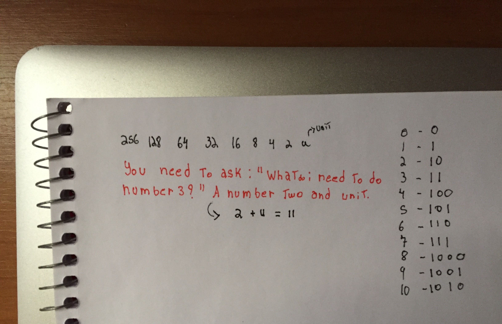

# CODES 

[ASM_CODES](https://github.com/sidhawkss/LowLevel/tree/main/asm_codes)

# LowLevel
Notes and things that can be useful to understand low level. 

Counting from zero to ten in binary is an interesting process that you have to known. Basically you can make this with a question, example: "What do I need to do number 5 in binary ?"  You need a number 4 - (100) more one unit, thus it is represented as: 5 (101). Another example, the number ten, you need a eight and two like : 1000 + 0010 == 1010
Take  the table (256 - 128 - 64 - 32 - 16 - 8 - 4 - 2 - 1) as a refference, the format should be between adding just these numbers to make your desired number. 

